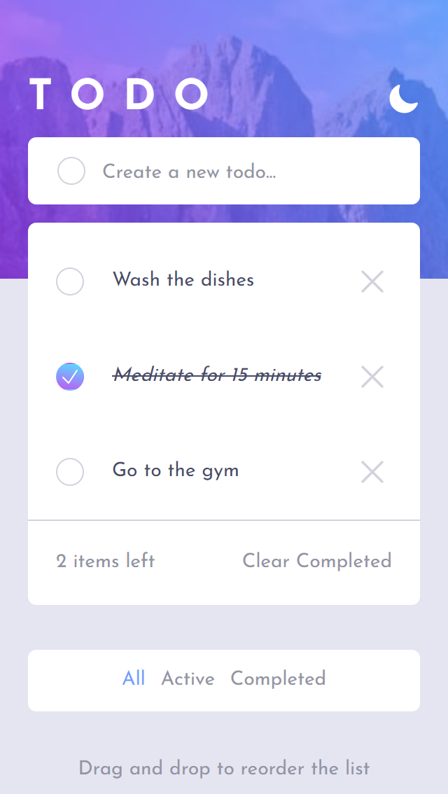
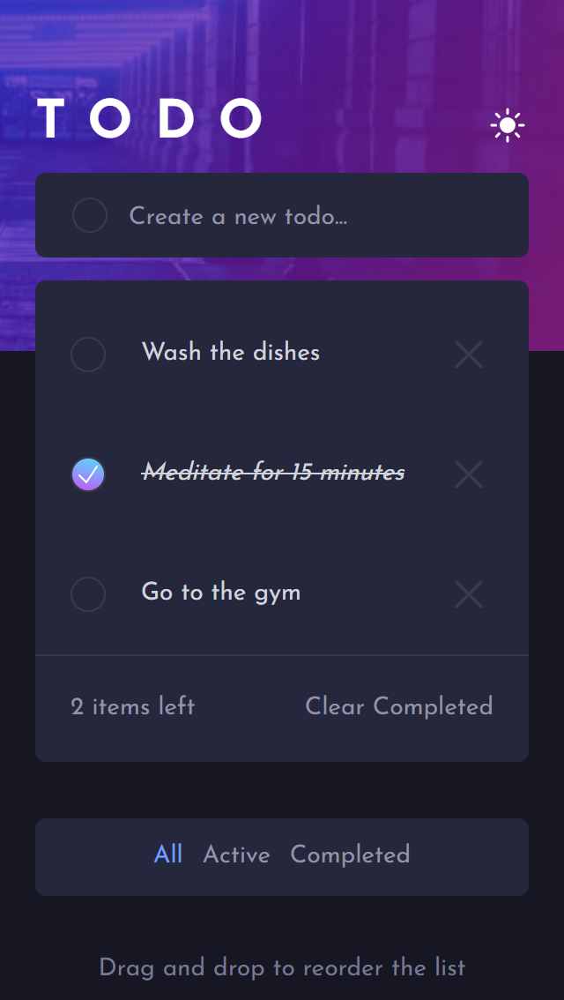
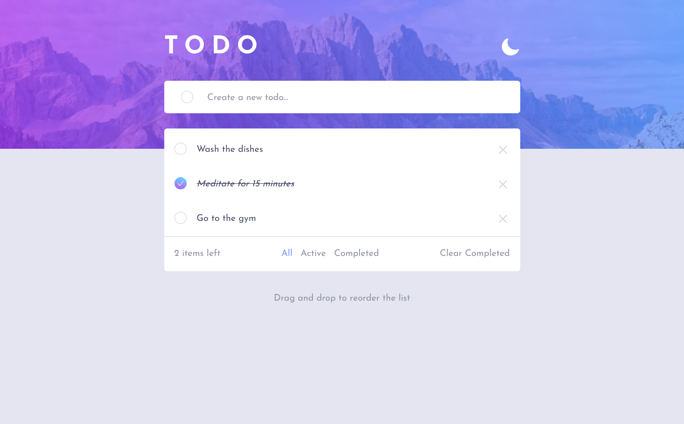
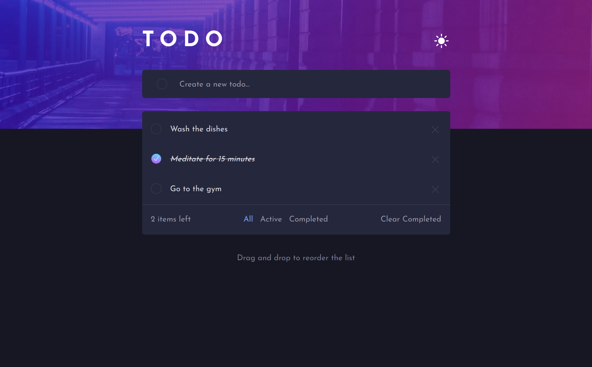

# Frontend Mentor - Todo app solution

Hello!

Firstly, thank you for taking your time to review my project.

This is a solution to the [Todo app challenge on Frontend Mentor](https://www.frontendmentor.io/challenges/todo-app-Su1_KokOW).

## Table of contents

- [Overview](#overview)
- [Screenshots](#screenshot)
- [Built with](#built-with)

## Overview

The users are able to:
- Add new todos - if they try to submit an empty form, they will receive an error.
- Mark todos completed and then make them active again.
- Delete single todos.
- Delete all of the compeleted todos in a bulk.
- See how much items they have left/completed.
- Filter between all todos, active todos and complete todos.
- Drag and drop the todos to reorder the list.
- Toggle between light and dark mode - initial mode is set up based on the user's preferences.
- See hover and focus states for all interactive elements on the page.
- View the optimal layout for the app depending on their device's screen size.

### Screenshot

Mobile - light mode:

Mobile - dark mode:

Desktop - light mode:

Desktop - dark mode:

### Built with

- Tailwind
- TypeScript
- React.js
- Custom Hooks
- Redux Toolkit
- React Beautiful DND Library
- Mobile-first workflow
